<div align="center">

# 💘 Crushie

### Where love meets technology

_AI-powered dating platform that connects hearts through vibe profiles, real-time coaching, and intelligent matching._

[](https://nextjs.org/)
[](https://expo.dev/)
[](https://expressjs.com/)
[](https://supabase.com/)
[](https://ai.google.dev/)
[](https://redis.io/)
[](https://clerk.com/)
[](https://www.typescriptlang.org/)

</div>

---

## Overview

**Crushie** is a full-stack AI-powered dating platform that uses **Vibe Profiles** — AI-generated personality cards derived from photos, quizzes, and behavioral signals — to match users based on cosine similarity of vector embeddings. The platform goes beyond simple swiping with features like real-time dating coaching, identity verification, gamified missions, social vouching, and a crush privacy cloak.

The project is built as a **monorepo** with three apps: a **Next.js web client**, an **Expo/React Native mobile client**, and a standalone **Express LLM service** powered by Google Gemini 2.5 Flash. All apps share a common **Supabase PostgreSQL** database layer with Row Level Security enforced through Clerk JWTs.

---

## Application Architecture

```mermaid
graph TD
    subgraph Clients["🖥️ Clients"]
        WEB["🌐 Web Client<br/><i>Next.js 16 · React 19</i>"]
        MOB["📱 Mobile Client<br/><i>Expo SDK 52 · React Native</i>"]
        EXT["🔗 External Services<br/><i>Webhooks · 3rd Party</i>"]
    end

    subgraph GATEWAY["⚙️ Next.js App — :3000"]
        CLERK["🔐 Clerk Middleware<br/><i>Auth · JWT Injection</i>"]
        TRPC["⚡ tRPC Router<br/><i>Type-safe · Batched · superjson</i>"]
        HONO["🌊 Hono REST Router<br/><i>JSON · OpenAPI-ready</i>"]
        DRIZZLE["🗄️ Drizzle ORM<br/><i>Type-safe SQL · RLS Transactions</i>"]
    end

    subgraph AI["🤖 LLM Service — :3001"]
        EXPRESS["📝 Express API<br/><i>Prompt Formatter · Templates</i>"]
        REDIS["⚡ Redis Cache<br/><i>SHA-256 Keys · TTL Eviction</i>"]
        GEMINI["🧠 Gemini 2.5 Flash<br/><i>Multimodal · Vision · JSON</i>"]
        TTS["🔊 ElevenLabs TTS<br/><i>Voice Coaching</i>"]
    end

    subgraph Storage["💾 Data Layer"]
        SUPA["🐘 Supabase PostgreSQL<br/><i>12+ Tables · RLS · pgvector</i>"]
        BUCKET["📦 Supabase Storage<br/><i>user-uploads · 10MB · Images</i>"]
    end

    WEB -->|"tRPC (httpBatchLink)"| CLERK
    MOB -->|"REST (Bearer Token)"| CLERK
    EXT -->|"REST (HTTP)"| CLERK

    CLERK --> TRPC
    CLERK --> HONO

    TRPC --> DRIZZLE
    HONO --> DRIZZLE

    DRIZZLE -->|"SQL + JWT Claims"| SUPA
    DRIZZLE --> BUCKET

    TRPC -->|"HTTP fetch"| EXPRESS
    HONO -->|"HTTP fetch"| EXPRESS

    EXPRESS --> REDIS
    REDIS -->|"Cache Miss"| GEMINI
    EXPRESS --> TTS

    style Clients fill:#fdf2f8,stroke:#ec4899
    style GATEWAY fill:#eff6ff,stroke:#3b82f6
    style AI fill:#f0fdf4,stroke:#22c55e
    style Storage fill:#fefce8,stroke:#eab308
```



### Service Topology

| Service              | Port    | Protocol | Description                         |
| -------------------- | ------- | -------- | ----------------------------------- |
| Next.js (Web Client) | `3000`  | HTTP     | Web app + API gateway (tRPC & Hono) |
| LLM Service          | `3001`  | HTTP     | AI prompt engine + response cache   |
| Supabase Postgres    | `5432`  | TCP      | Primary database with pgvector      |
| Redis                | `6379`  | TCP      | LLM response cache                  |
| Supabase Studio      | `54323` | HTTP     | Database admin UI (local dev)       |

### Dual API Pattern

Crushie serves two client types through a **shared database layer**:

- **tRPC** (`/api/trpc/*`) — Type-safe, batched, superjson-encoded. Used by the Next.js web app with TanStack Query hooks.
- **Hono REST** (`/api/mobile/*`) — Standard JSON REST. Used by mobile clients (React Native, Swift, Kotlin), webhooks, and third-party consumers.

Both routers share the same **Drizzle ORM → Supabase RLS** pipeline via `secureDb`, ensuring identical auth and data access regardless of transport.

---

## Key Features

| Feature                       | Description                                                                                                                                                                                       |
| ----------------------------- | ------------------------------------------------------------------------------------------------------------------------------------------------------------------------------------------------- |
| 🎭**Vibe Profile Generation** | AI-generated personality cards from photos + quiz answers using Gemini multimodal analysis. Produces vibe name, summary, energy level, mood/style/interest tags, and a 1536-dim vector embedding. |
| 💫**AI Vibe Matching**        | pgvector cosine similarity search finds compatible profiles. AI evaluates matches with narrative explanations, energy compatibility scores, and conversation starters.                            |
| 🔍**Profile Analyzer**        | Upload a screenshot of someone's profile → AI predicts communication style, generates conversation openers, and suggests personalized dates. Images are never stored — only SHA-256 hashes.       |
| 🎙️**Real-time Dating Coach**  | Live camera feed analysis using Gemini vision. Detects social cues and suggests what to say during dates. Includes ElevenLabs TTS for audio coaching.                                             |
| ✅**Identity Verification**   | Selfie liveness + photo match using Gemini vision. Detects spoofing (screen photos, prints, replays). Results stored as proof hashes.                                                             |
| 🎯**Gamified Missions**       | Mission templates (icebreaker, mini-date, adventure, challenge) with a full state machine. Dual-consent acceptance. Location-aware with Google Places.                                            |
| 🤝**Social Graph**            | Connections (pending/accepted/blocked), mutual friend detection, Drama-Guard warnings.                                                                                                            |
| 🏅**Vibe Vouching**           | Friends vouch across 8 tag types: looks like photos, safe vibes, great conversation, funny, respectful, adventurous, good listener, creative.                                                     |
| 🫣**Crush Privacy Cloak**     | Hide your profile from specific people — friends' crushes are filtered from match results.                                                                                                        |
| ⭐**Vibe Points**             | Gamified points ledger for mission completion, vouches received, and engagement. Delta-based accounting.                                                                                          |
| 📸**File Uploads**            | Supabase Storage bucket with RLS-scoped folders per user. 10MB limit, image types only.                                                                                                           |
| 🎨**Theme System**            | 20+ theme presets, light/dark mode, HSL color adjustments, URL-based theme switching.                                                                                                             |

---

## Tech Stack

### Web Client (`apps/web-client`)

| Layer        | Technology                                    |
| ------------ | --------------------------------------------- |
| Framework    | Next.js 16 (App Router)                       |
| Language     | TypeScript 5.9                                |
| UI           | React 19 · Tailwind CSS 4 · shadcn/ui (Radix) |
| API (Web)    | tRPC 11.8                                     |
| API (Mobile) | Hono 4.11                                     |
| ORM          | Drizzle ORM 0.45                              |
| Auth         | Clerk (`@clerk/nextjs`)                       |
| State        | Zustand 5 · TanStack React Query 5            |
| Forms        | React Hook Form 7 · Zod 4                     |
| Animations   | Framer Motion 12                              |

### LLM Service (`apps/llm`)

| Layer          | Technology              |
| -------------- | ----------------------- |
| Runtime        | Node.js 22 (Alpine)     |
| Framework      | Express 4               |
| AI Model       | Google Gemini 2.5 Flash |
| Text-to-Speech | ElevenLabs              |
| Cache          | Redis 7 (ioredis)       |
| Validation     | Zod 3                   |
| Testing        | Vitest                  |

### Mobile Client (`apps/mobile`)

| Layer      | Technology                     |
| ---------- | ------------------------------ |
| Framework  | Expo SDK 52                    |
| Runtime    | React Native 0.76              |
| Navigation | Expo Router v4                 |
| Auth       | Clerk (`@clerk/clerk-expo`)    |
| Data       | TanStack React Query 5         |
| Styling    | NativeWind v4 (Tailwind CSS 3) |
| State      | Zustand 5                      |

### Infrastructure

| Layer         | Technology                        |
| ------------- | --------------------------------- |
| Database      | Supabase (PostgreSQL 15)          |
| Vector Search | pgvector (1536-dim embeddings)    |
| Auth          | Clerk JWT → Supabase RLS          |
| Storage       | Supabase Storage (`user-uploads`) |
| Cache         | Redis 7                           |
| Containers    | Docker · Docker Compose           |
| Monorepo      | npm workspaces                    |

---

## Project Structure

```
crushie/
├── apps/
│   ├── web-client/             # Next.js 16 — Web app + API host (tRPC + Hono)
│   │   ├── src/
│   │   │   ├── app/            # Next.js App Router pages
│   │   │   ├── components/     # React components (UI, analyzer, discover, onboard)
│   │   │   ├── server/         # tRPC & Hono routers, server init
│   │   │   ├── services/       # Business logic (LLM, missions, social, verification…)
│   │   │   ├── db/             # Drizzle schema & secure client
│   │   │   ├── trpc/           # tRPC client & provider
│   │   │   ├── lib/            # Utilities (Supabase client, color converter)
│   │   │   └── types/          # Shared TypeScript types
│   │   └── supabase/           # Web-specific migration overrides
│   │
│   ├── llm/                    # Express — Gemini AI + Redis + ElevenLabs TTS
│   │   ├── src/
│   │   │   ├── lib/            # Gemini, Redis, ElevenLabs, prompt templates
│   │   │   └── routes/         # API route handlers
│   │   ├── Dockerfile          # Node.js 22 Alpine container
│   │   └── docker-compose.yml  # LLM + Redis stack
│   │
│   └── mobile/                 # Expo SDK 52 — iOS & Android
│       ├── app/                # Expo Router file-based routing
│       ├── src/
│       │   ├── components/     # React Native components
│       │   ├── hooks/          # Custom hooks
│       │   ├── lib/            # API client, utilities
│       │   └── providers/      # Auth, query providers
│       ├── android/            # Android native project
│       └── ios/                # iOS native project
│
├── supabase/
│   ├── config.toml             # Local Supabase configuration
│   └── migrations/             # SQL schema migrations
│       ├── 00001_initial_schema.sql
│       ├── 00002_vibe_platform_schema.sql
│       └── 00003_storage_bucket.sql
│
├── ARCHITECTURE.md             # Detailed system architecture & data flows
├── SYSTEM_DESIGN.md            # Data schema, API specs, RLS policies
└── package.json                # npm workspaces root
```

---

## Getting Started

### Prerequisites

- **Node.js** 22+
- **Docker** (for Supabase local dev & LLM service)
- **npm** (workspace manager)
- API keys: [Clerk](https://clerk.com/), [Google AI (Gemini)](https://ai.google.dev/), [ElevenLabs](https://elevenlabs.io/) (optional)

### Installation

```bash
# Clone the repository
git clone https://github.com/anhlamtruong/crushy.git
cd crushy

# Install all workspace dependencies
npm install

# Configure environment variables
cp apps/web-client/.env.example apps/web-client/.env
cp apps/llm/.env.example apps/llm/.env
# Edit both .env files with your API keys

# Start local Supabase (requires Docker)
npm run supa:start

# Run database migrations
npm run db:migrate

# Start development servers
npm run dev:web     # Web client → http://localhost:3000
npm run dev:llm     # LLM service → http://localhost:3001
npm run dev:mobile  # Expo dev server
```

---

## Environment Variables

### Web Client (`apps/web-client/.env`)

| Variable                            | Description                                       |
| ----------------------------------- | ------------------------------------------------- |
| `DATABASE_URL`                      | PostgreSQL connection string (Supabase)           |
| `NEXT_PUBLIC_CLERK_PUBLISHABLE_KEY` | Clerk frontend key                                |
| `CLERK_SECRET_KEY`                  | Clerk backend secret                              |
| `NEXT_PUBLIC_APP_URL`               | App URL (default:`http://localhost:3000`)         |
| `LLM_URL`                           | LLM service URL (default:`http://localhost:3001`) |
| `LLM_SERVICE_TOKEN`                 | Shared secret for LLM service auth                |

### LLM Service (`apps/llm/.env`)

| Variable                | Description                                             |
| ----------------------- | ------------------------------------------------------- |
| `PORT`                  | Server port (default:`3001`)                            |
| `NODE_ENV`              | Environment (`development` / `production`)              |
| `GEMINI_API_KEY`        | Google AI API key for Gemini                            |
| `REALTIME_GEMINI_MODEL` | Model name (default:`gemini-2.5-flash`)                 |
| `ELEVENLABS_API_KEY`    | ElevenLabs API key for TTS                              |
| `ELEVENLABS_VOICE_ID`   | Voice ID for coaching audio                             |
| `ELEVENLABS_MODEL_ID`   | TTS model (default:`eleven_turbo_v2_5`)                 |
| `LLM_SERVICE_TOKEN`     | Shared secret (must match web client)                   |
| `REDIS_URL`             | Redis connection URL (default:`redis://localhost:6379`) |
| `REDIS_CACHE_TTL`       | Cache TTL in seconds (default:`3600`)                   |
| `CORS_ORIGINS`          | Allowed CORS origins                                    |
| `RATE_LIMIT_MAX`        | Max requests per window (default:`60`)                  |

### Mobile Client (`apps/mobile/.env`)

| Variable                            | Description                                    |
| ----------------------------------- | ---------------------------------------------- |
| `EXPO_PUBLIC_CLERK_PUBLISHABLE_KEY` | Clerk frontend key                             |
| `EXPO_PUBLIC_API_URL`               | API base URL (default:`http://localhost:3000`) |

---

## API Overview

### tRPC Router (`/api/trpc/*`)

```
appRouter
├── users              → getMe, updateProfile, syncFromClerk
├── vibeProfiles       → getMe, create, update, findSimilar, getByUserId
├── social             → connections, matches, mutuals, vouches, crushList, points
├── missions           → templates, propose, accept, start, decline, progress, checkin
├── verification       → status, isVerified, request, badges, analyze, analyzerSessions
├── llm                → generateVibe, analyzeProfile, evaluateMatch, findAndEvaluateMatches
├── realtime           → getLiveSuggestion
├── uploads            → uploadOnboardImage, uploadAnalyzerImage, get/delete
└── environment        → config
```

### LLM Service Routes (`/api/*`)

| Route                     | Method | Description                                |
| ------------------------- | ------ | ------------------------------------------ |
| `/api/health`             | GET    | Health check + Redis connectivity          |
| `/api/prompt/templates`   | GET    | List all prompt templates                  |
| `/api/prompt/run`         | POST   | Execute a registered template              |
| `/api/prompt/raw`         | POST   | Execute a custom formatted prompt          |
| `/api/vibe-profile`       | POST   | Generate Vibe Card (Gemini multimodal)     |
| `/api/analyzer`           | POST   | Analyze profile screenshot (Gemini vision) |
| `/api/evaluate-match`     | POST   | AI compatibility evaluation                |
| `/api/verify-identity`    | POST   | Face match + spoofing detection            |
| `/api/realtime-coach`     | POST   | Live dating coach (camera → suggestion)    |
| `/api/realtime-coach/tts` | POST   | Text-to-speech via ElevenLabs              |

All production endpoints require `X-Service-Token` header. Mock endpoints (`/mock`) are available for development.

---

## Database Schema

The database consists of **12+ tables** across 3 migrations, with **pgvector** for similarity search and **Row Level Security** on all tables.

| Table                   | Purpose                                                  |
| ----------------------- | -------------------------------------------------------- |
| `users`                 | User profiles (Clerk ID as PK)                           |
| `vibe_profiles`         | AI-generated personality cards +`vector(1536)` embedding |
| `connections`           | Social graph (pending/accepted/blocked)                  |
| `vibe_matches`          | AI-generated pairings with similarity scores             |
| `mission_templates`     | Reusable mission catalogue with objectives & points      |
| `mission_instances`     | Per-match mission execution with state machine           |
| `user_mission_progress` | Per-user state within mission instances                  |
| `verifications`         | Identity verification records                            |
| `vibe_vouches`          | Friend vouches (8 tag types, anonymous by default)       |
| `crush_list`            | Privacy cloak entries                                    |
| `analyzer_sessions`     | Screenshot analysis results (images never stored)        |
| `vibe_points_ledger`    | Gamification points (delta-based)                        |

**Key Functions:**

- `find_similar_vibes()` — pgvector cosine similarity search
- `check_mutual_connections()` — Mutual friend detection
- `auth.user_id()` — Clerk JWT extraction for RLS

---

## Scripts Reference

| Script                       | Description                     |
| ---------------------------- | ------------------------------- |
| `npm run dev:web`            | Start web client dev server     |
| `npm run build:web`          | Build web client for production |
| `npm run dev:llm`            | Start LLM service dev server    |
| `npm run build:llm`          | Build LLM service               |
| `npm run dev:mobile`         | Start Expo dev server           |
| `npm run dev:mobile:ios`     | Run on iOS simulator            |
| `npm run dev:mobile:android` | Run on Android emulator         |
| `npm run db:generate`        | Generate Drizzle migrations     |
| `npm run db:migrate`         | Run database migrations         |
| `npm run db:push`            | Push schema changes (dev only)  |
| `npm run db:studio`          | Open Drizzle Studio             |
| `npm run supa:start`         | Start local Supabase            |
| `npm run supa:stop`          | Stop local Supabase             |
| `npm run func:serve`         | Serve Edge Functions locally    |
| `npm run func:deploy`        | Deploy Edge Functions           |

---

## Docker

The LLM service runs as a Docker container with Redis:

```bash
cd apps/llm
docker compose up --build
```

This starts:

- **llm-prompt-service** (Node.js 22 Alpine) on port `3001`
- **llm-redis** (Redis 7) on port `6379`

---

## Further Reading

- [ARCHITECTURE.md](ARCHITECTURE.md) — Detailed system architecture, data flow diagrams, and service responsibility matrix
- [SYSTEM_DESIGN.md](SYSTEM_DESIGN.md) — Data schema, table specs, pgvector strategy, RLS policy map, API specifications, and mission state machine
- [apps/web-client/README.md](apps/web-client/README.md) — Web client setup and development guide
- [apps/llm/README.md](apps/llm/README.md) — LLM service API documentation and prompt template reference
- [apps/mobile/README.md](apps/mobile/README.md) — Mobile client setup for iOS and Android

---

## License

This project is proprietary. All rights reserved.
